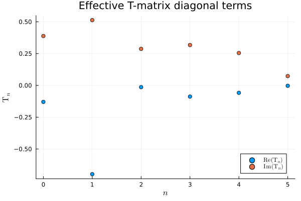
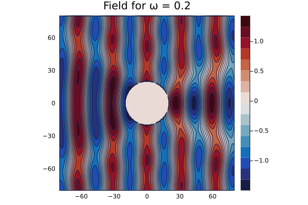
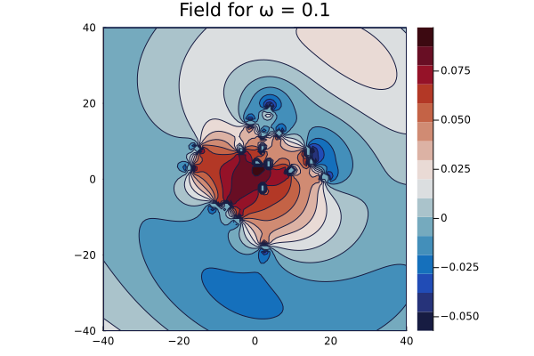
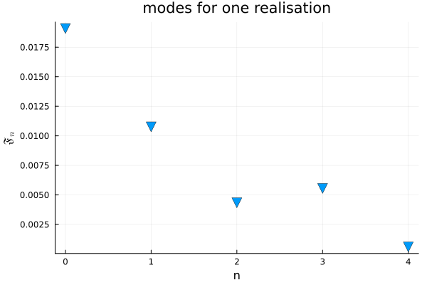
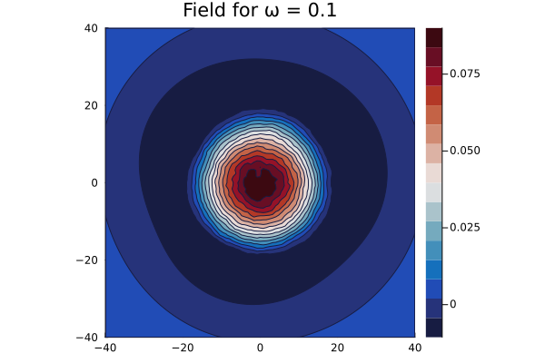
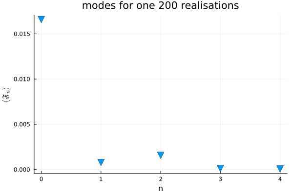

# EffectiveTMatrix.jl
A Julia library for computing the effective T-matrix of a random particulate sphere or cylinder.

[](https://github.com/Kevish-Napal/EffectiveTMatrix.jl/actions)

[](http://codecov.io/github/Kevish-Napal/EffectiveTMatrix.jl?branch=main)


## Installation

[Install Julia v1.6.1 or later](https://julialang.org/downloads/) then run in the Julia REPL:

```julia
using Pkg
Pkg.add https://github.com/Kevish-Napal/EffectiveTMatrix.jl.git
```

The maths is briefly explained below through examples. More details will be available soon in an upcoming publication. 

## The acoustic  particulate cylinder

### A  bit of the underlying maths
The propagation of waves in free space is governed by the 2D Helmholtz equation. We denote by $\mathrm V_n$ and $\mathrm U_n$ the cylindrical Bessel functions

$$
 \mathrm V_n(k\mathbf r):=\mathrm J_n(kr)\mathrm e^{\mathrm in\theta} 
\quad\text{and}\quad
\mathrm U_n(k \mathbf r):= \mathrm H_n(k r)\mathrm e^{\mathrm in\theta}
$$

where $k$ is the background wavenumber and  $(r,\theta)$ are the polar coordinates of $\mathbf r$, ie $\mathbf r = (r\cos \theta,r\sin\theta)$, $\mathrm J_n$ and $\mathrm H_n$ are respectively the Bessel function of order zero and the Hankel function. 

We consider the scattering from a set of $J$ cylinders confined in a circular area of radius $R$. The  incident field $u_i$ can be decomposed in modes:

$$
\tag{1}
u_i(\mathbf r) =  \sum_{n=-\infty}^{+\infty}g_n\mathrm V_n(k\mathbf r),\quad g_n\in\mathbb{C}.
$$

Then the averaged scattered field $\langle u_s\rangle$ (over all possible configurations of the $J$ cylinders confined in the disc of radius $R$) can be written

$$
\tag{2}
\langle u_s\rangle(\mathbf r) =  \sum_{n=-\infty}^{+\infty}\mathfrak F_n\mathrm H_n(k\mathbf r), \quad \mathfrak F_n = \mathrm T_ng_n
$$

where $\mathrm T_n\in\mathbb{C}$ is related to the effective T-matrix $\mathrm T_{n,m}$ of the effective cylinder of radius $R$. More precisely,

$$
\tag{3}
\mathrm T_{n,m} := \delta_{n,m} \mathrm T_n.
$$

With this definition, the scattering from the effective cylinder of radius $R$ can be summerized in matrix form 

$$
\tag{4}
\mathbf{\mathfrak{F} = \mathbf T \mathbf g}
$$

where we defined the vectors $\mathbf{\mathfrak{F}}=(\mathfrak F_n)_n$ and $\mathbf g = (g_n)_n$.

---
**Purpose of this package**

<ol>
  <li> Compute the effective T-matrix by using the Effective Waves Method </li>
  <li> Validate the result with Monte Carlo simulations</li>
</ol>

**__NOTE:__** The package currently focuses on the ensemble average of acoustic cylinders in a homogeneous host medium. The code is setup to easily integrate higher dimensions and other physics such as elastodynamics or electromagnetics. The package can also potentially take into account more complex microstructures (the two medium problem).

---

### Demo 1: Computation of the coefficients $\mathrm T_n$ 

*cf. examples/plane_wave_scattering/plane_wave_scattering.jl*

First set the dimension and physics of the problem by defining the host medium:

```julia
# 2D acoustic problem
dimension=2;                               
host_medium = Acoustic(dimension; ρ=1.0, c=1.0);
```

We consider a random particulate cylinder made of sound hard particles of radius 1.0. We also need to choose the volume fraction (density of particles). These information are stored in sp_MC:

```julia
## particulate microstructure of the effective cylinder
particle = Particle(Acoustic(dimension; ρ=Inf, c=Inf),Circle(1.0)); # sound hard particles of radius 1.0 
sp_MC = Specie(particle; volume_fraction = .4) 
```

Finally, the cylinder is defined by it's radius and microstructure, ie an homogeneous material with the particles previously defined. For now, the homogeneous material has to be the same as the one of the host material:

```julia
## define the effective cylinder
cylinder_radius = 20.0;
microstructure = Microstructure(host_medium,[sp_MC]);
cylinder = Material(Circle(cylinder_radius),microstructure);
```

To compute the coefficients $\mathrm T_n$ of the effective T-matrix, we need to specify the frequency $\omega$ and the number of coefficients to compute:

```julia
## compute the coefficients of the T-matrix 
ω = .2; # frequency
N = 5;  # Tₙ for n ∈ [-N,N]
T = t_matrix(ω, host_medium, cylinder, basis_field_order=N);
```

<p align="center">
    
</p>


The computation of the T-matrix uses the Effective Waves Method and is relatively fast. In Demo 2, we show how these results are validated with Monte Carlo simulations. 

Once these coefficients are computed, the scattering from any incident field can be computed by using the decomposition (1) of the incident field and formula (2) for the scattered field. Below is an example for computing the average pressure field resulting from an incident plane wave:

```julia
# Define the incident plane wave
psource = plane_source(host_medium; direction = [1.0,0.0]);

# Define box where to compute the average scattered field 
P=Q=4*cylinder_radius;                   # bounding box size
bottomleft = [-P;-Q]; topright = [P;Q];
region = Box([bottomleft, topright]);    # bounding box

us = average_scattered_field(ω, region, psource, cylinder; basis_field_order=N);
plot(us,ω; field_apply=real,seriestype = :contour,c=:balance) 
plot!(title="average pressure field")
```


<p align="center">
    
</p>


### Demo 2: Monte Carlo validation of the coefficients $\mathrm T_n$ 

cf examples/monte_carlo_validation/monte_carlo_validation.jl

### Demo 3: Monte Carlo validation of the diagonal form of the T-matrix

cf examples/modal_scattering/modal_scattering.jl


## II) The mode to mode scattering in a 2D setting
### Modal source

For a 2D setting, a modal source is of the form 

$$\mathrm V_n(\mathbf{kr}) := \mathrm J_n(kr)\mathrm e^{\mathrm in\theta}$$

where $\mathbf{r}=(r\cos\theta,r\sin\theta)$. It is defined by 

```julia
dimension=2;                                       
host_medium = Acoustic(dimension; ρ=1.0, c=1.0);   # 2D acoustic problem
mode = 0;                                          # mode n=0 
source = mode_source(host_medium,mode);            # V_0
```

To plot the source field, we need to set a frequency $\omega$, define a box where to plot the field and choose a resolution

```julia
ω=0.1;                                    # frequency
M=N=20;                                   # sizes of the rectangle where to plot
bottomleft = [-M;-N]; topright = [M;N];
region = Box([bottomleft, topright]);
plot(source,ω;bounds=region,res=100)
```

<p align="center">
    
</p>

### Scattering from one configuration of particles

We can draw one configuration of particles confined in a disc of choosen radius "radius_big_cylinder", then compute the scattered field as follows,

We first need to define the parameters for particles configurations:

```julia
# parameters for particles configurations
radius_big_cylinder = 20.0;                                 # radius of cylinder where particles are confined 
ϕ = 0.05;                                                   # volume fraction (density of particles)
separation_ratio = 1.001;                                   # minimum distance between particles
particle = Particle(Acoustic(2; ρ=Inf, c=Inf),Circle(1.0)); # particles type: sound hard particles
sp_MC, sp_EF = generate_species(radius_big_cylinder,
                                particle,
                                ϕ,
                                separation_ratio);          # defines specie sp_MC (sp_EF will be explained and used later)
```

sp_MC contains the statistics of the particles configuration, particles configurations are then drawn as follows:

```julia
particles_realisation = renew_particle_configurations(sp_MC,radius_big_cylinder);
plot(particles_realisation)
```

<p align="center">
    
</p>


We can now compute the scattered field

```julia
basis_order=5;
sim = FrequencySimulation(particles_realisation,source);
scattered_field = run(sim,region,[ω];only_scattered_waves=true,basis_order=basis_order,res=res);

plot(scattered_field,ω; field_apply=real,seriestype = :contour,c=:balance) 
```

<p align="center">
    
</p>

The Scattered field can be decomposed in modes $\mathrm U_n$ defined by 
$$\mathrm U_n(k\mathbf{r}) := \mathrm H_n(kr)\mathrm e^{\mathrm in\theta}$$

We have 

$$u_s(\mathbf{r}) =  \sum_{n=-\infty}^{+\infty} \mathfrak{F}_n\mathrm U_n(k\mathbf{r})$$

The modal amplitudes are computed as follows:

```julia
basis_field_order = 4;                                    # number of modes to compute
F1 = mode_analysis(mode, ω, host_medium, sp_MC;
                radius_big_cylinder=radius_big_cylinder, 
                basis_order=basis_order, 
                basis_field_order=basis_field_order,
                nb_iterations=1);

scatter(0:basis_field_order,abs.(F1),label=false,markerstrokewidth=.5,markersize=7,markershape=:dtriangle)
```

<p align="center">
    
</p>

### Average scattered field over particles configurations

The previous steps can be repeated in order to compute the averaged scattered field over several particles configurations, denoted $\langle u_s \rangle(\mathbf{r})$. 

$$\langle u_s \rangle(\mathbf{r}) =  \sum_{n=-\infty}^{+\infty} \langle \mathfrak{F}_n\rangle \mathrm U_n(k\mathbf{r})$$

The averaged scattered field is computed as follows:

```julia 
x_vec, _ = points_in_shape(region;resolution=res);                            # space discretization 
nb_of_configurations = 200;
A = complex(zeros(length(x_vec),nb_of_configurations));                       # store the fields of each configurations
@time Threads.@threads for i=1:nb_of_configurations
    particles = renew_particle_configurations(sp_MC,radius_big_cylinder);
    sim = FrequencySimulation(particles,source);
    us = run(sim,x_vec,[ω];only_scattered_waves=true,basis_order=basis_order)
    A[:,i] = mean.(us.field[:,1]) 
end 
mean_A  = mean(A,dims=2);
mean_us = FrequencySimulationResult(mean_A,x_vec,[ω]);
plot(mean_us,ω; field_apply=real,seriestype = :contour,c=:balance) 
```

<p align="center">
    
</p>


The empirical average of $\langle \mathfrak{F}_n\rangle$ obtained with 200 configurations is computed by

```julia 
F2 = mode_analysis(mode, ω, host_medium, sp_MC;
                radius_big_cylinder=radius_big_cylinder, 
                basis_order=basis_order, 
                basis_field_order=basis_field_order,
                nb_iterations=nb_of_configurations);

scatter(0:basis_field_order,abs.(F2),label=false,markerstrokewidth=.5,markersize=7,markershape=:dtriangle)
scatter!(xlabel="n",ylabel=L"$\langle\mathfrak{F}_n\rangle$")
scatter!(title="modes for one $(nb_of_configurations) realisations")
```


<p align="center">
    
</p>