# EffectiveTMatrix.jl
A Julia library for computing the effective T-matrix of a random particulate sphere or cylinder.

[](https://github.com/Kevish-Napal/EffectiveTMatrix.jl/actions)

[](http://codecov.io/github/Kevish-Napal/EffectiveTMatrix.jl?branch=main)


## Installation

[Install Julia v1.6.1 or later](https://julialang.org/downloads/) then run in the Julia REPL:

```julia
using Pkg
Pkg.add https://github.com/Kevish-Napal/EffectiveTMatrix.jl.git
```

The maths is briefly explained below through examples. More details will be available soon in an upcoming publication. 

## The acoustic  particulate cylinder

The propagation of waves in free space is governed by the 2D Helmholtz equation. We denote by $\mathrm V_n$ and $\mathrm U_n$ the cylindrical Bessel functions

$$
\tag{1}
 \mathrm V_n(k\mathbf r):=\mathrm J_n(kr)\mathrm e^{\mathrm in\theta} 
\quad\text{and}\quad
\mathrm U_n(k \mathbf r):= \mathrm H_n(k r)\mathrm e^{\mathrm in\theta}
$$

where $k$ is the background wavenumber and  $(r,\theta)$ are the polar coordinates of $\mathbf r$, ie $\mathbf r = (r\cos \theta,r\sin\theta)$, $\mathrm J_n$ and $\mathrm H_n$ are respectively the Bessel function of order zero and the Hankel function. 

We consider the scattering from a set of $J$ cylinders confined in a circular area of radius $R$. The  incident field $u_i$ can be decomposed in modes:

$$
\tag{2}
u_i(\mathbf r) =  \sum_{n=-\infty}^{+\infty}g_n\mathrm V_n(k\mathbf r),\quad g_n\in\mathbb{C}.
$$

Then the averaged scattered field $\langle u_s\rangle$ (over all possible configurations of the $J$ cylinders confined in the disc of radius $R$) can be written

$$
\tag{3}
\langle u_s\rangle(\mathbf r) =  \sum_{n=-\infty}^{+\infty} \langle \mathfrak F_n \rangle\mathrm H_n(k\mathbf r), \quad  \langle \mathfrak F_n \rangle = \mathrm T_ng_n
$$

where $\mathrm T_n\in\mathbb{C}$ is related to the effective T-matrix $\mathrm T_{n,m}$ of the effective cylinder of radius $R$. More precisely,

$$
\tag{4}
\mathrm T_{n,m} := \delta_{n,m} \mathrm T_n.
$$

With this definition, the scattering from the effective cylinder of radius $R$ can be summerized in matrix form 

$$
\tag{5}
 \langle \mathbf{F} \rangle = \mathbf T \mathbf g
$$

where we defined the vectors $ \langle \mathbf{F} \rangle=( \langle \mathfrak F_n \rangle)_n$ and $\mathbf g = (g_n)_n$.

---
**Purpose of this package**

<ol>
  <li> Compute the effective T-matrix by using the Effective Waves Method </li>
  <li> Validate the result with Monte Carlo simulations</li>
</ol>

**__NOTE:__** The package currently focuses on the ensemble average of acoustic cylinders in a homogeneous host medium. The code is setup to easily integrate higher dimensions and other physics such as elastodynamics or electromagnetics. The package can also potentially take into account more complex microstructures (the two medium problem).

---

## Example 1: Computation of the coefficients $\mathrm T_n$ 

*cf. examples/pressure_field*

First set the dimension and physics of the problem by defining the host medium:

```julia
# 2D acoustic problem
dimension=2;                               
host_medium = Acoustic(dimension; ρ=1.0, c=1.0);
```

We consider a random particulate cylinder made of sound hard particles of radius 1.0. We also need to choose the volume fraction (density of particles). These information are stored in sp_MC:

```julia
## particulate microstructure of the effective cylinder
particle = Particle(Acoustic(dimension; ρ=Inf, c=Inf),Circle(1.0)); # sound hard particles of radius 1.0 
sp_MC = Specie(particle; volume_fraction = .4) 
```

Finally, the cylinder is defined by it's radius and microstructure, ie an homogeneous material with the particles previously defined. For now, the homogeneous material has to be the same as the one of the host material:

```julia
## define the effective cylinder
cylinder_radius = 20.0;
microstructure = Microstructure(host_medium,[sp_MC]);
cylinder = Material(Circle(cylinder_radius),microstructure);
```

To compute the coefficients $\mathrm T_n$ of the effective T-matrix, we need to specify the frequency $\omega$ and the number of coefficients to compute:

```julia
## compute the coefficients of the T-matrix 
ω = .2; # frequency
N = 5;  # Tₙ for n ∈ [-N,N]
T = t_matrix(ω, host_medium, cylinder, basis_field_order=N);
```

<p align="center">
    
</p>


The computation of the T-matrix uses the Effective Waves Method and is relatively fast. In Example 2 below, we show how to validate these results with Monte Carlo simulations. 

Once these coefficients are computed, the scattering from any incident field can be computed by using the decomposition (Eq. 2) of the incident field and formula (Eq. 3) for the scattered field. Note that the T-matrix does not depend on the incident field. Below is an example for computing the average pressure field resulting from an incident plane wave and a point source

```julia
## Define incident planar wave and point source
# define the plane wave
plane_wave = plane_source(host_medium; direction = [1.0,0.0]);

# define the point source
x0 = [-4.5cylinder_radius,0.0];                    # origin of the point source
A = 1.0;                                           # amplitude of the point source
point_wave = point_source(host_medium, x0, A);
```

We then define a region where to compute the pressure field:

```julia
# Define the incident plane wave
psource = plane_source(host_medium; direction = [1.0,0.0]);

# Define box where to compute the average scattered field 
P=Q=4*cylinder_radius;                   # bounding box size
bottomleft = [-P;-Q]; topright = [P;Q];
region = Box([bottomleft, topright]);    # bounding box
```

Finally the field is computed and plot with

```julia
## scattering from incident plane wave
us_plane_wave = average_scattered_field(ω, region, plane_wave, cylinder; basis_field_order=N);
plot(us_plane_wave, ω; field_apply=real,seriestype = :contour,c=:balance) 
plot!(title="Scattering from incident plave wave")

## scattering from point source
us_point_source = average_scattered_field(ω, region, point_wave, cylinder; basis_field_order=N);
plot(us_point_source,ω; field_apply=real,seriestype = :contour,c=:balance) 
plot!(title="Scattering from incident point source")
```

<p align="center">
  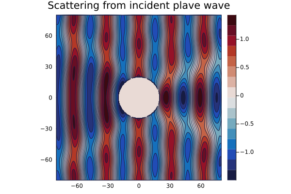
  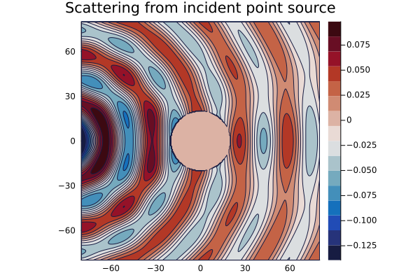 
</p>


## Example 2: Monte Carlo validation of the coefficients $\mathrm T_n$ 

*cf. examples/monte_carlo_validation*

In the previous example, we showed how to use the function *t_matrix* to compute the effective T-matrix of the cylinder. The latter relied on the Effective Waves Method which is fast and do not need to compute any average. This package also implements Monte Carlo simulations which allows to validate these results.  

Standard Monte Carlo simulations consists in solving the scattering problem several times, compute the empirical average of the scattered field and then compare the results with the predicted effective properties of the homogenized material. In this section is shown how to run the Monte Carlo simulations. In the next section will be shown in details how the effective T-matrix is sampled and how we make use of the spherical geometry to accelerate the Monte Carlo simulations.

#### Fixed set of parameters

First define the host medium 

```julia
## define host_medium
dimension=2;
host_medium = Acoustic(dimension; ρ=1.0, c=1.0);
```

Then define properties of the effective cylinder:

```julia
## particulate microstructure of the effective cylinder
particle = Particle(Acoustic(2; ρ=1e-2, c=1.0),Circle(1.0));   # sound soft particle of radius 1.0 
sp_MC = Specie(particle; volume_fraction = .05) 

## radius of the effective cylinder
cylinder_radius = 20.0;
```

Finally we set the frequency and some parameters required for the Monte Carlo simulations:
\omeg   

```julia
ω=.1                   # frequency
basis_field_order = 4; # sample Tₙ for n ∈ [0;basis_field_order] 

## other Monte Carlo parameters
kws_MC = Dict(
    :basis_order => 5,                       # truncation of the Foldy-Lax equation
    :basis_field_order => basis_field_order, # sample Tₙ for n ∈ [0;basis_field_order] 
    :nb_iterations_max => 6000,              # max number of iterations
    :nb_iterations_step => 100,              # convergence criteria is checked at every steps
    :prec => 5e-2                            # precision of the Monte Carlo simulation
);
```

The result is stored in an object of type MonteCarloResult that has to be initialise. The function run_MC_validation! runs the Monte Carlo simulation. The result can simply be plot using the function plot:

```julia
MC = MonteCarloResult(ω,sp_MC,cylinder_radius; basis_field_order=basis_field_order);
run_MC_validation!(host_medium, MC; kws_MC...);
plot(MC)
```

<p align="center">
  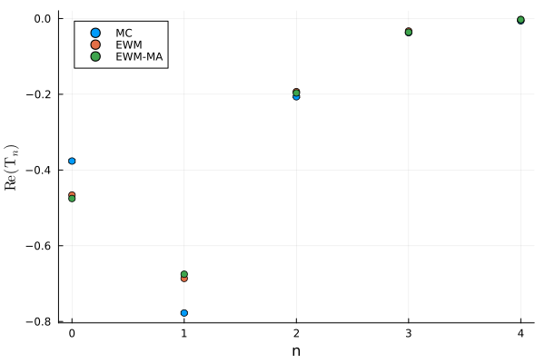
</p>


The plot above shows $\mathrm{Re}(\mathrm T_n)$ for $n\in[0,4]$ using three different methods: the Monte Carlo simulations (MC), the Effective Waves Method (EWM) and the Monopole Approximation of the Effective Waves Method (EFM-MA). The latter method is obtained when the particles are approximated with monopole scatterers and give good results in the case of quasi-monopole scatterers (cf. next paragraph).


#### List set of parameters

Running Monte Carlo simulations on a list of parameters is very similar to the above, one only need to initialise a vector of MonteCarloResult objects instead. Here is an example of a multi frequencies simulation:

```julia
## MC loop on frequency
Ω = collect(.1:.05:1.5);
MC_vec = [MonteCarloResult(ω,sp_MC,cylinder_radius) for ω ∈ Ω];
run_MC_validation!(host_medium, MC_vec; kws_MC...);

# plot results
plot(MC_vec)
```

<p align="center">
  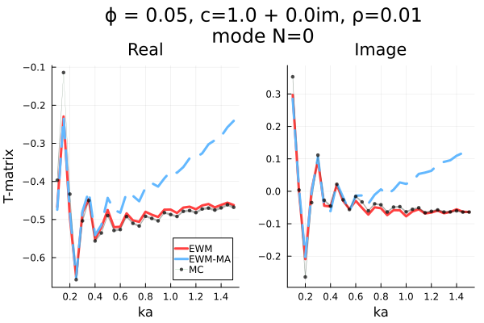
</p>

The Monopole approximation method (EWM-MA) gives a good approximation in the low frequency regime because the sound soft particles are then quasi-monopole scatterers.

## Example 3: The mode to mode scattering

*cf examples/modal_scattering*

The goal of this section is to clarify how the function run_MC_validation! presented in the previous Example 2. computes the coefficients $\mathrm T_n$ of the effective T-matrix.

### 3.1) Radial scattering

#### 3.1.a) Radial source

For a 2D setting, a modal source is of the form 

$$
\tag{6}
u_i(\mathbf{r}) = \mathrm V_n(\mathbf{kr})
$$

where $\mathrm V_n(\mathbf{kr})$ is defined by (Eq. 1). We first show an example with a radial source which is a specific modal source with $n=0$

```julia
dimension=2;                                       
host_medium = Acoustic(dimension; ρ=1.0, c=1.0);   # 2D acoustic problem
input_mode = 0;                                          # mode n=0 
source = mode_source(host_medium,input_mode);            # V_0
```

To plot the source field, we need to set a frequency $\omega$, define a box where to plot the field and choose a resolution

```julia
ω=0.1;                                    # frequency
M=N=20;                                   # sizes of the rectangle where to plot
bottomleft = [-M;-N]; topright = [M;N];
region = Box([bottomleft, topright]);
plot(source,ω;bounds=region,res=100)
```

<p align="center">
    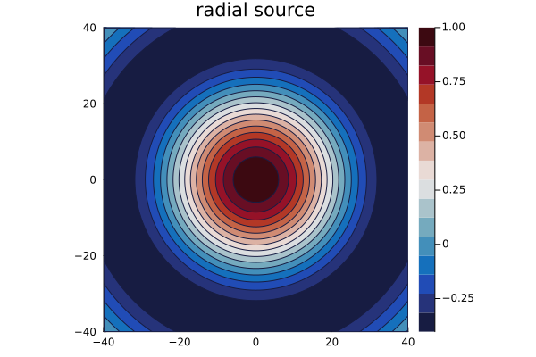
</p>

#### 3.1.b) Scattering from one configuration of particles

We first need to define the parameters for particles configurations:

```julia
# parameters for particles configurations
radius_big_cylinder = 20.0;                                 # radius of cylinder where particles are confined 
particle = Particle(Acoustic(2; ρ=Inf, c=Inf),Circle(1.0)); # particles type: sound hard particles of radius 1
sp_MC = Specie(particle; volume_fraction = .05);            # # volume fraction is the density of particles
```

sp_MC then contains the statistics of the particles configuration, a specific configuration of particles is drawn with the function renew_particle_configurations as follows:

```julia
particles_realisation = renew_particle_configurations(sp_MC,radius_big_cylinder);
plot(particles_realisation)
```

<p align="center">
    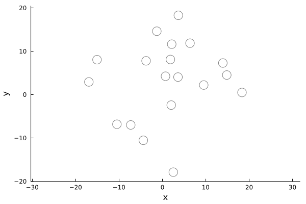
</p>


We can now compute the scattered field

```julia
basis_order=5;
sim = FrequencySimulation(particles_realisation,source);
scattered_field = run(sim,region,[ω];only_scattered_waves=true,basis_order=basis_order,res=res);

plot(scattered_field,ω; field_apply=real,seriestype = :contour,c=:balance) 
```

<p align="center">
    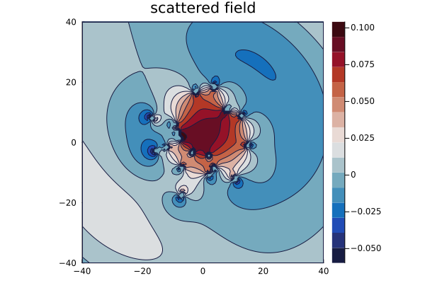
</p>

The scattered field $u_s$ can be decomposed in modes $\mathrm U_n$ defined by (Eq. 1):

$$
\tag{7}
u_s(\mathbf{r}) =  \sum_{n=-\infty}^{+\infty} \mathfrak{F}_n\mathrm U_n(k\mathbf{r}),
\qquad
\mathfrak{F}_n :=  \sum_{i=1}^J\sum_{n'=-\infty}^{+\infty}\mathrm V_{n'-n}(-k\mathbf r_i)f_{n'}^i
$$

The coefficients $\mathfrak F_n$ depend on the particles configuration, which centers are given by $\mathbf r_1,\dots,\mathbf r_J$. In the above, the coefficients $f_{n}^i$ are obtained after solving the Foldy-Lax equations. The coefficients $\mathfrak F_n$ for $ n \in [0,\text{basis\_field\_order}]$ are computed as follows:

```julia
basis_field_order = 4;                                    # number of modes to compute
F = mode_analysis(input_mode, ω, host_medium, sp_MC;
                radius_big_cylinder=radius_big_cylinder, 
                basis_order=basis_order, 
                basis_field_order=basis_field_order,
                nb_iterations=1);

scatter(0:basis_field_order,abs.(F),label=false,markerstrokewidth=.5,markersize=7,markershape=:dtriangle)
```

<p align="center">
    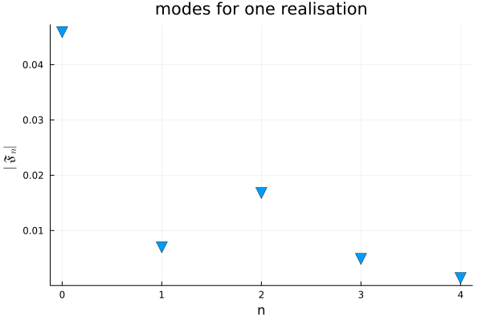
</p>

#### 3.1.c) Average scattered field over particles configurations

The previous steps can be repeated in order to compute the averaged scattered field over several particles configurations, denoted $\langle u_s \rangle(\mathbf{r})$. 

$$
\tag{8}
\langle u_s \rangle(\mathbf{r}) =  \sum_{n=-\infty}^{+\infty} \langle \mathfrak{F}_n\rangle \mathrm U_n(k\mathbf{r})
$$

The averaged scattered field is computed as follows:

```julia 
x_vec, _ = points_in_shape(region;resolution=100);                            # space discretization 
nb_of_configurations = 200;                                                   # total number of config 
A = complex(zeros(length(x_vec),nb_of_configurations));                       # store the fields of each config

for i=1:nb_of_configurations
    particles = renew_particle_configurations(sp_MC,radius_big_cylinder);     # renew config
    sim = FrequencySimulation(particles,source);
    us = run(sim,x_vec,[ω];only_scattered_waves=true,basis_order=basis_order) # solve for specific config
    A[:,i] = mean.(us.field[:,1]) 
end 
mean_A  = mean(A,dims=2);
mean_us = FrequencySimulationResult(mean_A,x_vec,[ω]);

# plot average scattered field
plot(mean_us,ω; field_apply=real,seriestype = :contour,c=:balance) 
```

<p align="center">
    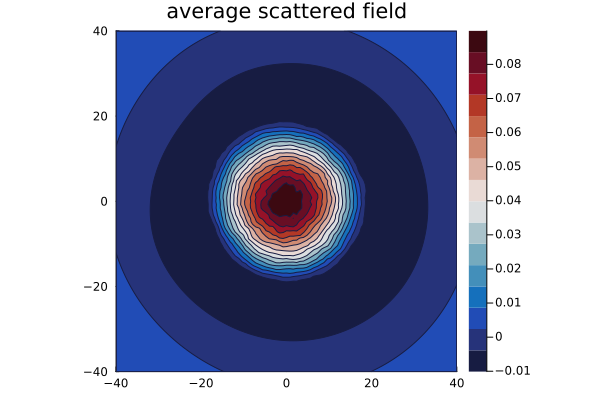
</p>


The empirical average of $\langle \mathfrak{F}_n\rangle$ obtained with 200 configurations is computed by specifying nb_iterations=200 in the function mode_analysis:

```julia 
F_average = mode_analysis(mode, ω, host_medium, sp_MC;
                radius_big_cylinder=radius_big_cylinder, 
                basis_order=basis_order, 
                basis_field_order=basis_field_order,
                nb_iterations=nb_of_configurations);

scatter(0:basis_field_order,abs.(F_average),label=false,markerstrokewidth=.5,markersize=7,markershape=:dtriangle)
scatter!(xlabel="n",ylabel=L"$\langle\mathfrak{F}_n\rangle$")
scatter!(title="modes for one $(nb_of_configurations) realisations")
```


<p align="center">
    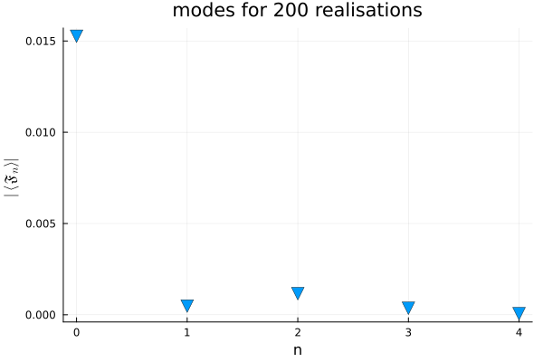
</p>

We can see from this previous plot that the empirical average $\langle\mathfrak F_n\rangle\approx 0 $ if $n\neq0$ and this is an expected result for a source of the form (6): the resulting scattered field is also radial:

$$
\tag{9}
u_i(\mathbf r) = \mathrm V_0(k\mathbf r)
\implies
\langle u_s\rangle(\mathbf r) = \langle\mathfrak F_0\rangle\mathrm U_0(k\mathbf r)
$$

#### 3.1.d) Computation of $\mathrm T_0$

The radial source (6) corresponds to the choice $g_n=\delta_{n,0}$ in (2). From (3), we see that $\langle u_s\rangle(\mathbf r)$ then coincide with (9), furthermore we have that $\mathrm T_0 = \langle\mathfrak F_0\rangle$. The computation of this quantity doesn't require to compute the whole scattered field $u_s(\mathbf r)$ but only the coefficient $\mathfrak F_0$ provided by (7) with $n=0$. $\langle\mathfrak F_0\rangle$ is then computed by averaging several realisations of $\mathfrak F_0$ over particle configurations.

### 3.2) Modal scattering

The result (9) is valid for other modal sources: for any $n$,

$$
\tag{10}
u_i(\mathbf r) = \mathrm V_n(k\mathbf r)
\implies
\langle u_s\rangle(\mathbf r) = \langle\mathfrak F_n\rangle\mathrm U_n(k\mathbf r)
$$

The radial case corresponded to the case $n=0$, we illustrate this result again with the choice $n=3$ (change imput_mode $= 3$ instead of $0$ in the above). We obtain the following results:


<p align="center">
  
</p>


<p align="center">
  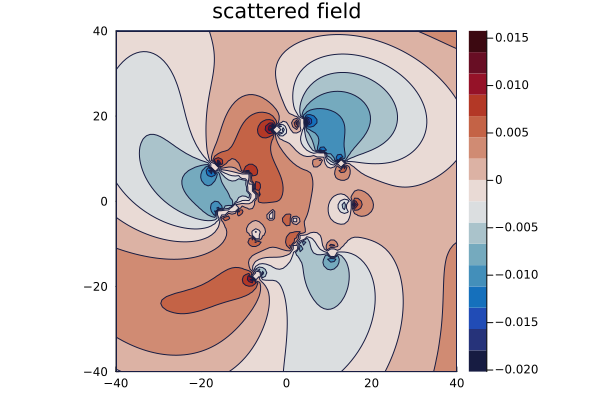
  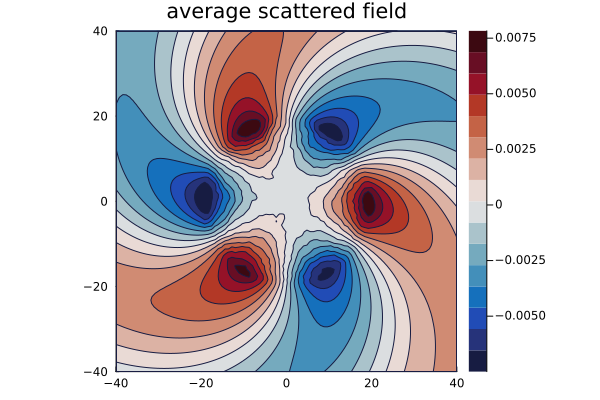 
</p>

<p align="center">
  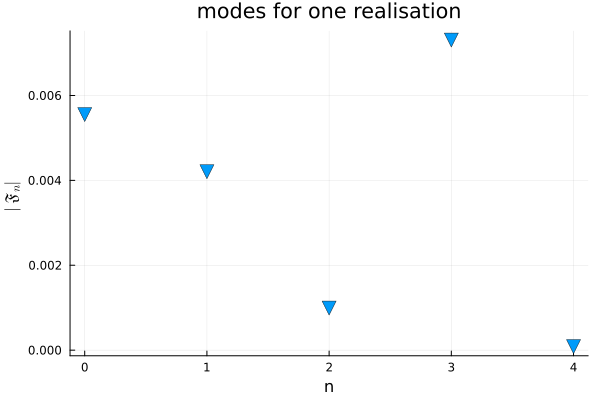
  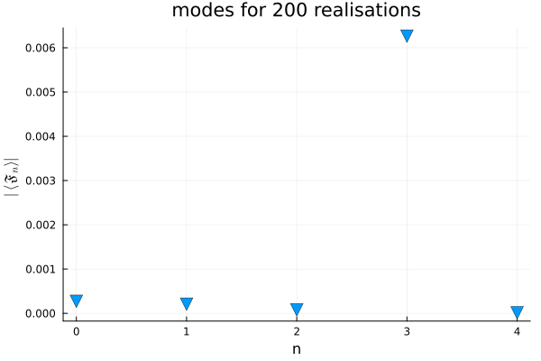 
</p>

The coefficient $\langle\mathfrak F_n\rangle$ appearing in (10) corresponds to  $\mathrm T_n$. This quantity is computed with (7) and averaged other particles configurations. The function run_MC_validation! uses this modal scattering property to compute the coefficients of the effective T-matrix.